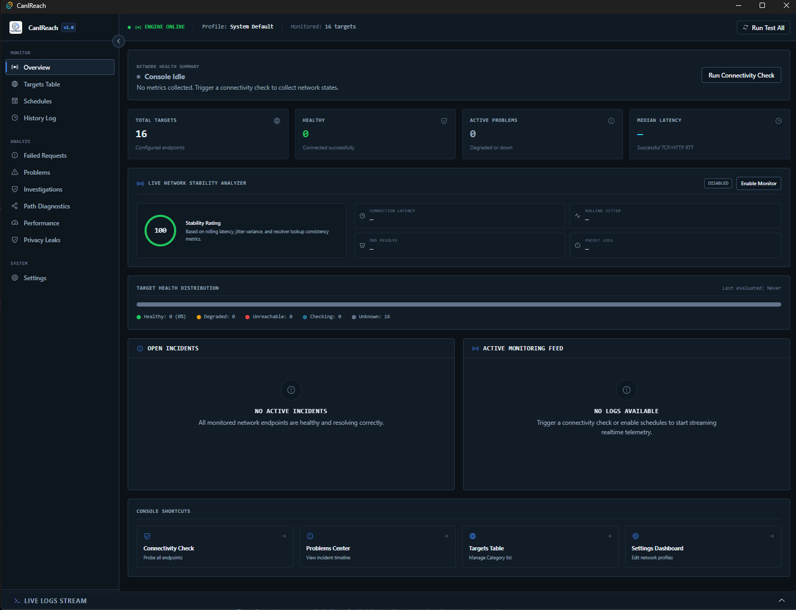
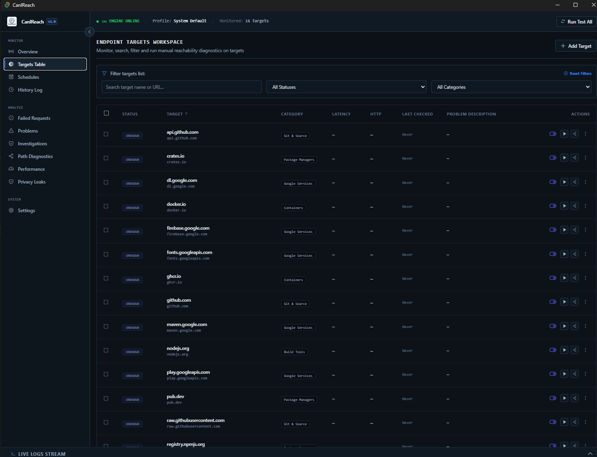

<p align="center">
  
</p>

# CanIReach

A local-first, zero-telemetry network diagnostics and reachability monitoring console for developers.

---

## 🌟 Overview

**CanIReach** is a modern desktop application built to analyze, monitor, and diagnose connection health for critical developer services, repositories, package registries, and APIs. It combines a high-concurrency Rust probing engine with a responsive, dark-first React dashboard to help developers diagnose network blocks, censorships, or VPN/proxy routing failures.

---

## 🎯 Why CanIReach?

Many developer services and APIs (like Google APIs, Maven, npm, Docker Hub, OpenAI, and Anthropic) can be intermittently slow or blocked depending on local network gateways and routing policies. CanIReach provides instant, local visibility into:
1. Is a service reachable directly, or is it blocked?
2. Does name resolution (DNS) fail, or is the TCP port closed?
3. Is a SOCKS5/HTTP proxy successfully resolving the routing block?
4. How stable is the local gateway and network connection over time?

---

## 🛠️ Key Capabilities

* **High-Concurrency Probing**: Spawns concurrent Tokio workers (with user-defined queues) to resolve name lookups, TCP handshakes, TLS handshakes, and HTTP headers in parallel.
* **Manual Redirect Isolation**: Step-by-step HTTP redirect tracking with loop protection, showing intermediate status codes and location headers.
* **Proxy Routing**: Map endpoints individually to SOCKS5, SOCKS5H (remote DNS resolution), or HTTP proxy profiles.
* **Live Network Stability Index**: Visualizes latency jitter standard deviations and gateway metrics in real-time.
* **Network Change Observer**: Debounced observer that detects changes in your local network gateway IP (e.g. connecting a VPN) and prompts you to retest.
* **Interactive Path Traceroute**: Visualizes intermediate router hops, round-trip times (RTT), and packet loss points.
* **Live Developer Log Stream**: Bounded in-memory terminal console streaming real-time diagnostic logs.

---

## 🖼️ Interface Preview

Here is a preview of the CanIReach workspace panels:

| Dashboard Overview | Endpoint Targets Datagrid |
|---|---|
|  |  |

---

## 💻 Supported Platforms

* **Windows**: Fully supported (.msi, .exe packages).
* **macOS**: Fully supported (.dmg, .app packages).
* **Linux**: Experimental support.

---

## 🚀 Installation

### 1. Desktop Client
Download the packaged installers (`.exe`, `.dmg`, `.AppImage`, `.deb`) directly from the [GitHub Releases](https://github.com/ebrahimkhodadadi/CanIReach/releases) page.

### 2. Standalone CLI (via npm)
You can run or install the prebuilt CLI binary instantly using Node/npm (no Rust or compilation required):

```bash
# Run once without installing:
npx @ebrahimkhodadadi/canireach github.com

# Or install globally:
npm install -g @ebrahimkhodadadi/canireach
canireach github.com
```

### 3. Direct Binary Install Script (Unix & Windows)
To download the compiled CLI binary directly and verify its integrity checksum:

* **macOS / Linux (Bash)**:
  ```bash
  curl -fsSL https://raw.githubusercontent.com/ebrahimkhodadadi/CanIReach/main/scripts/install.sh | bash
  ```
* **Windows (PowerShell)**:
  ```powershell
  irm https://raw.githubusercontent.com/ebrahimkhodadadi/CanIReach/main/scripts/install.ps1 | iex
  ```

### 4. Cargo Install (Source Build)
If you have the Rust toolchain installed, compile and install from source:
```bash
cargo install --git https://github.com/ebrahimkhodadadi/CanIReach.git --bin canireach
```

---

## 🛠️ Development Setup

### 1. Prerequisites
Ensure you have the following toolchains installed:
* **Node.js**: v18+ and npm.
* **Rust**: Stable Cargo toolchain ([rustup.rs](https://rustup.rs/)).

### 2. Development Run
```bash
# Clone the repository
git clone https://github.com/ebrahimkhodadadi/CanIReach.git
cd CanIReach

# Install dependencies
npm install

# Start Vite HMR server and launch the desktop client
npm run tauri dev
```

### 3. Build Desktop Installer locally
```bash
npm run tauri build
```

---

## 📖 Documentation Index

For details on architecture, troubleshooting, and advanced configurations, view the documents under **[`docs/`](docs/)**:

* **[Getting Started Guide](docs/getting-started.md)**: Workspace divisions and basic terminology.
* **[Installation Guide](docs/installation.md)**: Platform dependencies and build requirements.
* **[Usage Guide](docs/usage.md)**: Running tests, tracing paths, and scheduled monitoring.
* **[CLI Guide](docs/cli.md)**: Command-line tool manual, shell completions, and exit codes.
* **[Configuration Reference](docs/configuration.md)**: JSON setting files and folder paths.
* **[Diagnostics Details](docs/diagnostics.md)**: Diagnostic layers, HTTP codes, and manual redirects.
* **[Live Monitoring](docs/monitoring.md)**: Stability gauges, observers, and SQLite databases.
* **[Proxy & Network Selection](docs/proxy-and-network-selection.md)**: SOCKS5H and interface bindings.
* **[Architecture Overview](docs/architecture.md)**: Rust core crates and frontend event patterns.
* **[Developer Guide](docs/development.md)**: Clippy lint rules, formatting check, and Vitest runs.
* **[Troubleshooting Manual](docs/troubleshooting.md)**: Port binding conflicts, database locks, and runtime panics.
* **[Privacy & Security Policy](docs/privacy-and-security.md)**: Local-first limits and secure logging.
* **[Contributing Guidelines](docs/contributing.md)**: Pull request rules and target additions.

---

## 🤝 Contributing

We welcome community contributions! Please read our **[Contributing Guidelines](docs/contributing.md)** for coding standards, pull request templates, and default target submission details.

---

## 🔒 Privacy & Telemetry

CanIReach is **100% local-first and telemetry-free**. All statistics, target configurations, network profiles, and diagnostic logs stay on your local disk. No external analytical endpoints, logging servers, or tracking scripts are queried.

---

## 📄 License

This repository does not currently bundle a default open-source license. The project owner reserves all rights. For licensing inquiries, contact the repository maintainer.