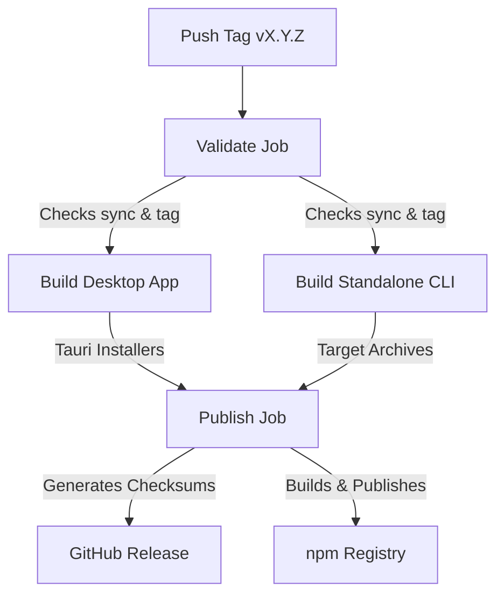

# Automated Release and Distribution Process

This document details the automated compilation, packaging, and distribution pipeline for **CanIReach**. 

---

## 🏷️ 1. Cutting a New Release

The entire release process is driven by a single Git version tag matching `v*.*.*`.

### Step 1: Bump and Synchronize Crate/JSON Versions
Before tagging, synchronize the version across all manifests (`package.json`, `Cargo.toml` files, and `tauri.conf.json`) using the helper tool:

```bash
# Update all versions to 1.0.0 (for example)
npm run sync-version -- --set 1.0.0
```

Verify that the versions are correctly synchronized:
```bash
npm run sync-version -- --check
```

### Step 2: Commit and Push the Version Tag
Commit the version changes and push the tag:

```bash
# Commit changes
git add .
git commit -m "chore: bump version to 1.0.0"

# Tag the commit and push
git tag v1.0.0
git push origin main --tags
```

---

## ⚙️ 2. Automated Pipeline Actions

Once the tag is pushed to GitHub, the **Production Release** GitHub Actions workflow (`release.yml`) is automatically triggered:



### Produced Artifacts

The pipeline builds and uploads the following deliverables to the GitHub Release:

| Platform | Desktop Installers | Standalone CLI Archives |
|---|---|---|
| **Windows x64** | `CanIReach_X.Y.Z_x64-setup.exe` | `canireach-vX.Y.Z-x86_64-pc-windows-msvc.zip` |
| **macOS Intel** | `CanIReach_X.Y.Z_universal.dmg` (Universal) | `canireach-vX.Y.Z-x86_64-apple-darwin.tar.gz` |
| **macOS Apple Silicon** | `CanIReach_X.Y.Z_universal.dmg` (Universal) | `canireach-vX.Y.Z-aarch64-apple-darwin.tar.gz` |
| **Linux x64** | `.AppImage` / `.deb` installers | `canireach-vX.Y.Z-x86_64-unknown-linux-gnu.tar.gz` |
| **Linux ARM64** | — | `canireach-vX.Y.Z-aarch64-unknown-linux-gnu.tar.gz` |

---

## 🛡️ 3. Signing and Notarization

Code signing is conditional and depends on the presence of corresponding secrets in the GitHub repository. If these secrets are absent, the build proceeds to package **unsigned** binaries, which will display standard OS security warnings upon installation.

### macOS (Apple Developer Notarization)
Requires:
* `APPLE_CERTIFICATE`: Base64 encoded p12 signing certificate.
* `APPLE_CERTIFICATE_PASSWORD`: Password for the p12 file.
* `APPLE_SIGNING_IDENTITY`: Code signing identity name.
* `APPLE_ID`: Apple developer ID email.
* `APPLE_PASSWORD`: App-specific password for Apple ID.
* `APPLE_TEAM_ID`: Apple Developer Team ID.

### Windows Code Signing
Requires:
* `WINDOWS_CERTIFICATE`: Base64 encoded code signing certificate (PFX).
* `WINDOWS_CERTIFICATE_PASSWORD`: Certificate password.

### Tauri Updater Signatures
Tauri validates update packages using public-key cryptography.
* Public key is committed in `src-tauri/tauri.conf.json` (`pubkey`).
* Private key is loaded via the `TAURI_SIGNING_PRIVATE_KEY` secret.
* Private key password is loaded via the `TAURI_SIGNING_PRIVATE_KEY_PASSWORD` secret.

---

## 📦 4. npm Registry Distribution

The CLI is packaged and distributed to npm using a scoped launcher package layout (`@ebrahimkhodadadi/canireach`).

* **Platform Packages**: Prebuilt native binaries are published into standalone packages (`@ebrahimkhodadadi/canireach-win32-x64`, etc.).
* **Launcher Package**: A thin Node.js launcher is published under `@ebrahimkhodadadi/canireach` that dynamically detects the host OS and architecture on install, selects the matching prebuilt platform binary, and executes it forwarding stdin/stdout/stderr and correct exit codes.
* This publication requires the `NPM_TOKEN` repository secret.

---

## 🦀 5. Crates.io Crate Distribution (Deferred)

Crates.io publishing is currently **disabled**. Because the `tauri-app` workspace crate compiles GUI dependencies (WebKit2GTK, GLib, etc.), building it via `cargo install` is heavy and fails on headless servers. 

To enable clean crates.io distribution in the future, the CLI binary source (`canireach.rs`) and core logic should be moved to a standalone non-GUI sub-crate (e.g. `crates/canireach-cli`) that does not depend on Tauri.

---

## 🔄 6. Rollback and Re-releases
* **DO NOT** delete a tag and push a new commit with the same tag version. Registries like npm and crates.io do not allow overwriting published versions, which will break the release flow.
* If a release fails or contains bugs, bump the patch version (e.g., `1.0.0` ➔ `1.0.1`) and cut a new tag.
